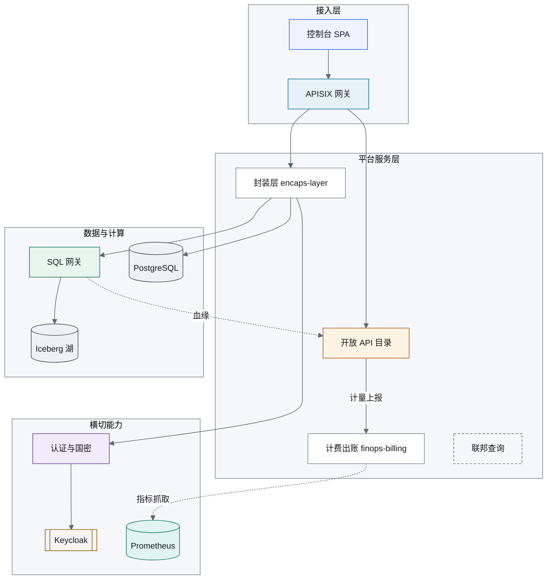
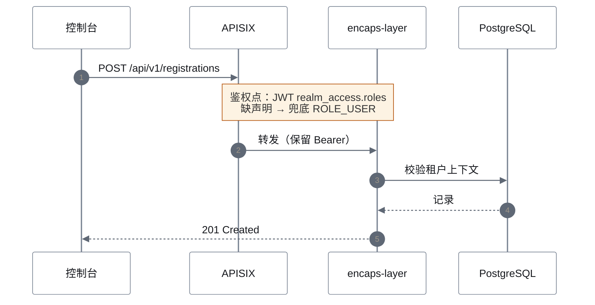
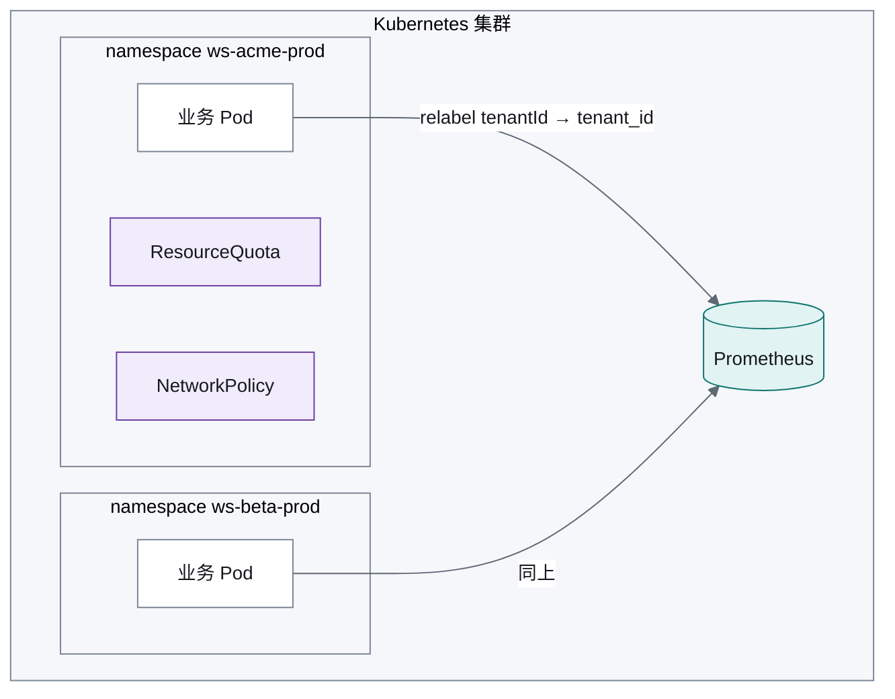
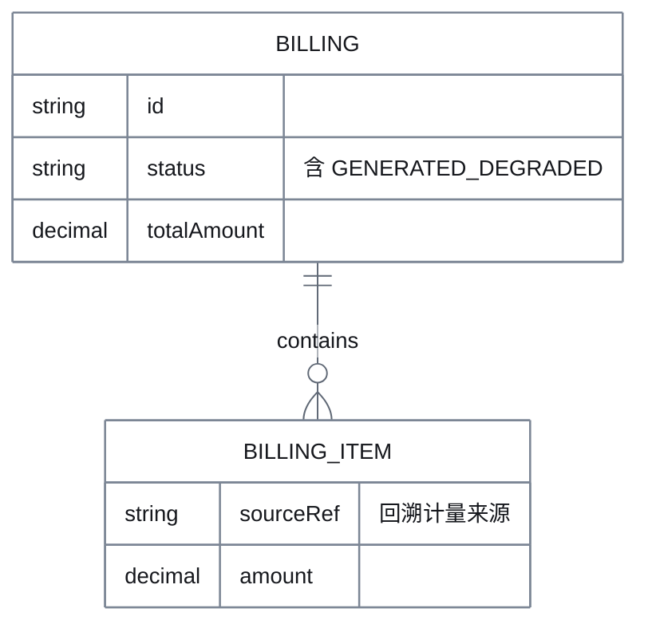

# 数擎平台图样规范（Mermaid 样式基线）

> 制定日期：2026-09-26 ｜ 适用：`docs/**`、`design/**` 内全部 Mermaid 图
> 机器校验：`scripts/check-mermaid-style.py`（已挂 CI，见第 7 节）

## 1. 为什么要定这份规范

先给事实，不凭印象（由 `scripts/mermaid-inventory.py` 实测，可随时复跑）：

| 指标 | 实测值 |
|---|---|
| Mermaid 块总数 | **189**，分布在 **49** 个 `.md` |
| 带 `%%{init}%%` 主题声明的块 | **0** |
| 使用 `classDef` 语义类的块 | **0** |
| 使用行内 `style` 的块 | 5（各自为政，无统一色） |
| 独立图样文件（`.drawio` / `.puml` / `.mmd`） | **0** |
| 仍以 ASCII 字符画作图的设计文档 | **91** 份 |

块类型分布决定了规范必须覆盖什么：

```
graph 110 · sequenceDiagram 34 · flowchart 23 · erDiagram 12 · gantt 9 · stateDiagram-v2 1
```

也就是说：**同一套样式必须同时管住结构图、时序图、ER 图三类**，否则只会再出现一次
"每份文档各画各的"。当前状态是 189 块零主题零语义类 —— 图能渲染，但**颜色不携带任何信息**，
读者无法从外观区分自研服务与外部依赖、GA 组件与规划骨架。

## 2. 设计原则

1. **配色与产品 UI 同源**：优先直接取 `frontend/src/styles/design-tokens.css` 的语义 token
   值（`--ds-accent` `#2563eb`、`--ds-success` `#0e7a4a` 等）。产品界面和架构图讲的是同一个
   系统，不该有两套视觉语言。
2. **颜色只表达"组件身份"，不表达"好坏"**：绿=计算引擎、青=可观测，不是"健康"。
   运行状态属于监控大盘，不属于架构图。
3. **形状与颜色共同编码**：存储用圆柱 `[(...)]`、外部依赖用 `[["..."]]`、规划中用虚线边框。
   这样黑白打印/色觉障碍读者仍能分辨（见第 3 节的对比度实测）。
4. **不为了好看引入产品没有的颜色**：确需额外色相时，明确标注"图样专用"，
   不冒充设计 token（第 4 节表格里已区分）。
5. **渐进收敛，不一次性改写 189 块**：门禁按棘轮只禁止"新增未样式化的块"（第 7 节）。

## 3. 主题块（每个图的第一行，必须逐字一致）

```
%%{init: {"theme":"base","themeVariables":{"fontFamily":"PingFang SC,Microsoft YaHei,Helvetica Neue,Arial,sans-serif","fontSize":"14px","background":"#ffffff","primaryTextColor":"#16181d","primaryColor":"#ffffff","primaryBorderColor":"#7c8695","lineColor":"#5f6875","actorBkg":"#ffffff","actorBorder":"#7c8695","actorTextColor":"#16181d","signalColor":"#5f6875","signalTextColor":"#16181d","labelBoxBkgColor":"#f5f7fb","labelTextColor":"#16181d","noteBkgColor":"#fdf3e3","noteBorderColor":"#b45309","clusterBkg":"#f5f7fb","clusterBorder":"#7c8695"}}}%%
```

三点必须解释清楚，否则后人会"顺手优化"坏它：

- **为什么写十六进制而不是 `var(--ds-accent)`**：GitHub 渲染 Mermaid 时不加载产品样式表，
  CSS 变量在图的上下文里解析不出来，结果是**所有元素退化成无色**。所以这里必须是字面色值，
  并且值要与 token 对齐（改 token 时同步改这里，由第 7 节门禁比对提示）。
- **为什么钉死 `background:#ffffff`**：GitHub 页面在暗色模式下仍会把图渲染在深色底上，
  若不显式指定背景，浅色填充配不上文字。这里刻意让每张图自带"白纸"底，
  明暗两种页面下观感一致 —— 图是**出版物**，不跟随站点主题。
- **为什么 `fontFamily` 里放中文字体**：默认 sans 在部分渲染环境缺中文字形，
  中文标签会掉成方框。

## 4. 语义类词汇表

**只允许下列类名**。新增类别需要先在本文件登记（含对比度实测），再进脚本白名单。

| 类名 | 含义 | 填充 | 描边 | 建议形状 | 来源 |
|---|---|---|---|---|---|
| `ui` | 前端 / 控制台 | `#eef4ff` | `#2563eb` | `[ ]` | `--ds-accent-soft` / `--ds-accent` |
| `gw` | 接入与网关 | `#e7f2f8` | `#0b6e99` | `[ ]` | `--ds-info-soft` / `--ds-info` |
| `svc` | 自研服务（GA） | `#ffffff` | `#7c8695` | `[ ]` | `--ds-bg-surface` / `--ds-border-control` |
| `exp` | 自研服务（Experimental） | `#fdf3e3` | `#b45309` | `[ ]` | `--ds-warning-soft` / `--ds-warning` |
| `planned` | 规划中 / 骨架（未交付） | `#f5f7fb` | `#5f6875` 虚线 | `[ ]` | `--ds-bg-subtle` / `--ds-text-tertiary` |
| `engine` | 计算引擎 | `#e6f6ee` | `#0e7a4a` | `[ ]` | `--ds-success-soft` / `--ds-success` |
| `store` | 存储 / 数据湖 | `#eef1f6` | `#454d5a` | `[( )]` | 图样专用 |
| `sec` | 安全与合规 | `#f1ecfb` | `#6b3fa0` | `[ ]` | 图样专用 |
| `obs` | 可观测 | `#e2f3f4` | `#0f766e` | `[ ]` | 图样专用 |
| `ext` | 外部依赖 / 第三方 | `#f4f4f5` | `#8a5a00` | `[[ ]]` | 图样专用 |

对比度实测（脚本 `scripts/check-mermaid-style.py --contrast` 会重算，判据：
文本/填充 ≥4.5:1 满足 WCAG AA 正文，描边 ≥3:1 满足 WCAG 1.4.11 非文本对比度）：

```
ui 16.08:1 · gw 15.61:1 · svc 17.76:1 · exp 16.16:1 · planned 16.56:1
engine 15.88:1 · store 15.69:1 · sec 15.33:1 · obs 15.53:1 · ext 16.16:1
描边最弱项 svc 3.68:1（白底/填充双测均 ≥3:1）
```

**10/10 达标**，无一项靠"看起来够"。

连线语义（**注意：Mermaid 的 `:::类名` 只能作用于节点，边不支持具名类**）：

| 语义 | 写法 | 说明 |
|---|---|---|
| 同步调用 | `A --> B` | 默认色，不加样式 |
| 异步 / 消息 | `A -.-> B` | 用虚线形状表达，不靠颜色 |
| 计量与计费链路 | `A -->\|计量上报\| B` | **语义写在标签里**，不染色 |
| 血缘 / 元数据流 | `A -.->\|血缘\| B` | 同上 |

为什么不给边上色：Mermaid 只能按**位置索引**给边设样式（`linkStyle 3 stroke:#b45309`），
索引会随节点/边的增删整体错位 —— 加一条边就可能让"计费红线"指到别的连线上。
因此本规范规定：**边的语义一律用线型（实线/虚线）+ 标签文字表达，默认不上色**。
确需强调个别关键链路时，把特殊边写在边的列表**末尾**并用注释标明索引来源：

```
  %% 特殊着色边集中声明，且必须是列表最后 N 条，索引才稳定
  linkStyle 12 stroke:#b45309,stroke-width:2px;
```

### 4.1 规范 classDef 块（整段复制，不要手改色值）

```
  classDef ui fill:#eef4ff,stroke:#2563eb,color:#16181d;
  classDef gw fill:#e7f2f8,stroke:#0b6e99,color:#16181d;
  classDef svc fill:#ffffff,stroke:#7c8695,color:#16181d;
  classDef exp fill:#fdf3e3,stroke:#b45309,color:#16181d;
  classDef planned fill:#f5f7fb,stroke:#5f6875,color:#16181d,stroke-dasharray:4 3;
  classDef engine fill:#e6f6ee,stroke:#0e7a4a,color:#16181d;
  classDef store fill:#eef1f6,stroke:#454d5a,color:#16181d;
  classDef sec fill:#f1ecfb,stroke:#6b3fa0,color:#16181d;
  classDef obs fill:#e2f3f4,stroke:#0f766e,color:#16181d;
  classDef ext fill:#f4f4f5,stroke:#8a5a00,color:#16181d;
```

`planned` 的 `stroke-dasharray:4 3` 是刻意的：虚线让"规划中/未交付"在**黑白打印下**
仍能与已交付组件区分，不只依赖颜色。

## 5. 布局约定

| 图类型 | 方向 | 约定 |
|---|---|---|
| 分层架构 | `graph TB` | 自上而下：接入 → 服务 → 引擎/存储；横切能力（安全、可观测）单独 `subgraph` 放右侧 |
| 数据流 / 管道 | `graph LR` | 从左到右表示数据流向，禁止与分层图混用同一文件 |
| 请求时序 | `sequenceDiagram` | 参与者按"前端→网关→服务→存储"顺序声明；跨租户调用必须画 `Note` 标注鉴权点 |
| 部署拓扑 | `flowchart TB` | 用 `subgraph` 表达 namespace/节点；租户工作空间命名与代码一致：`ws-<tenantId>-<slug>` |
| ER | `erDiagram` | 关系符号只用 `||--o{` / `}o--{o` 等有明确基数含义的写法 |
| 多租户边界 | 任意 | 租户隔离边界统一用 `subgraph 租户边界`，内部节点标 `tenant` 类不适用——用 subgraph 标题表达 |

通用：
- 节点 ID 用英文小写（`billing_svc`），显示文本用中文（`计费出账`）；
- 单图节点数 > 25 时拆图，不靠缩小字号塞进去；
- 每张图标题写在围栏外的 `**图 X-N：xxx**` 里，便于引用。

## 6. 示例（四张，均已通过 `mermaid.parse()` 校验）

### 6.1 分层架构



### 6.2 租户请求时序（含鉴权点标注）



### 6.3 部署拓扑（租户工作空间）



### 6.4 ER 片段



## 7. 机器校验与收敛策略

`scripts/check-mermaid-style.py` 已挂 CI（standards job），做四件事：

1. **主题块**：新增/修改的 Mermaid 块首行必须是第 3 节那段 `%%{init}%%`（逐字比对）。
2. **类名白名单**：块内出现的 `classDef` / `:::name` 必须在第 4 节词汇表内，防止自造色。
3. **对比度复算**：`--contrast` 重算第 4 节所有配色的 WCAG 比值，任一不达标即失败。
4. **棘轮**：统计"未样式化块"总数，只允许**下降**不允许上升 —— 所以 189 个历史块
   不会被要求一次改完，但新写的每一张图都必须合规。

复跑事实统计：`python3 scripts/mermaid-inventory.py`。

## 8. 暂不纳入范围（如实说明）

- **`.drawio` / `.puml` 独立图样文件**：仍为 0。本规范只解决"文档内嵌图"的统一样式；
  需要可编辑大图（如对外交付的部署架构图）时再单独选型，避免现在就引入一套需要
  二进制文件与专用工具的资产体系。
- **91 份 ASCII 字符画文档的转换**：属于逐份改写工作，量大且需要理解每份文档的语义。
  按棘轮策略随内容改动逐步替换，不做一次性转换。
- **渲染效果截图验证**：本规范以 `mermaid.parse()` 验证语法可解析；GitHub 端实际
  视觉效果（字体缺失、连线交叉）需在真实渲染页面复核，尚未逐项确认。
