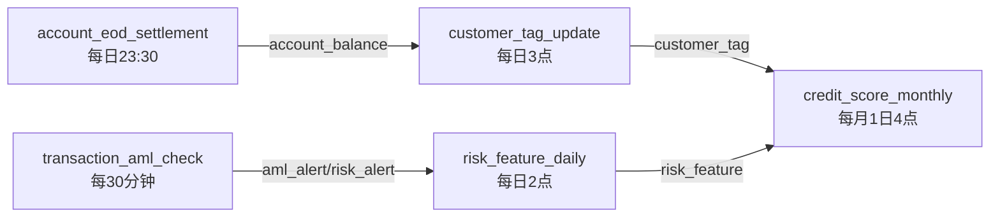

# 金融模板 DAG 调度作业设计说明

> 归属：数擎大数据平台 · L5.3 行业应用模板 · 金融模板（finance）
> 任务：T018-3 DAG 调度作业设计（≥5 个，1 人天）
> 上游：T018-2 金融 DDL 表（`../ddl/`，21 张表覆盖 5 业务域）
> 调度引擎：Apache DolphinScheduler 3.x（JSON DAG 导入格式）
> 字符集：UTF-8

## 第1章 概述

本目录基于 T018-2 完成的金融 DDL 表（5 业务域、21 张表），设计 **5 个 DAG 调度作业**，覆盖风控特征计算、客户标签更新、账户日终清算、交易反洗钱检查、信贷评分月度计算 5 类典型金融 ETL 场景。

DAG 采用 **Apache DolphinScheduler 3.x JSON 导入格式**，包含 `processDefinition`（工作流定义）、`processTaskRelationList`（任务依赖关系）、`taskDefinitionList`（任务定义）、`alertGroups`（告警组）四部分，可直接通过 DolphinScheduler 工作流导入功能加载验证。

### 1.1 设计原则

- **场景覆盖完整**：5 个 DAG 覆盖风控/客户/账户/交易/信贷 5 业务域，每个 DAG 至少 4 个任务节点，含抽取→计算→加载→通知完整链路。
- **依赖关系明确**：通过 `processTaskRelationList` 显式声明任务依赖，上游失败下游不执行（DolphinScheduler 默认行为）。
- **调度策略分级**：日批（凌晨 2/3 点）、日终（23:30）、准实时（每 30 分钟）、月批（每月 1 日凌晨 4 点）四级调度。
- **失败重试统一**：核心 SQL 任务 `failRetryTimes=3`，重试间隔 120~600s；通知任务 `failRetryTimes=1`。
- **超时分级**：抽取任务 1800s，聚合/加载任务 3600~5400s，月度评分 14400s，通知任务 300s。
- **告警双通道**：每个 DAG 配置飞书告警组 + 邮件通知，失败即时触达。
- **SQL 路径有效**：每个 SQL 任务同时内嵌 `sql` 字段与 `sqlFile` 路径，路径指向 `../sql/<dag_name>/` 目录。

### 1.2 文件清单

| 序号 | 文件 | DAG 名称 | 业务域 | 节点数 | 调度策略 | 描述 |
|---|---|---|---|---|---|---|
| 1 | `risk_feature_daily.json` | risk_feature_daily | 风控域 | 4 | `0 2 * * * ?` 每日凌晨 2 点 | 风控特征日计算 |
| 2 | `customer_tag_update.json` | customer_tag_update | 客户域 | 5 | `0 3 * * * ?` 每日凌晨 3 点 | 客户标签更新 |
| 3 | `account_eod_settlement.json` | account_eod_settlement | 账户域 | 6 | `30 23 * * * ?` 每日 23:30 | 账户日终清算 |
| 4 | `transaction_aml_check.json` | transaction_aml_check | 交易域 | 5 | `0,30 * * * * ?` 每 30 分钟 | 交易反洗钱检查 |
| 5 | `credit_score_monthly.json` | credit_score_monthly | 信贷域 | 6 | `0 4 1 * * ?` 每月 1 日凌晨 4 点 | 信贷评分月度计算 |
| - | `README.md` | - | - | - | - | 本说明文档 |
| - | **合计** | **5 个 DAG** | **5 域** | **26 节点** | - | - |

## 第2章 DAG 详细设计

### 2.1 risk_feature_daily — 风控特征日计算

**业务目标**：每日凌晨从 `transaction_detail` 聚合交易特征（笔数/金额/夜间占比等），写入 `risk_feature` 表，供风控模型评估使用。

**调度**：`0 2 * * * ?`（每日凌晨 2:00，Asia/Shanghai）

**数据流向**：

```text
transaction_detail → tmp_risk_feature_src → tmp_risk_feature_agg → risk_feature
```

**任务节点**：

| 任务 code | 任务名 | 类型 | 说明 | 重试 | 超时 |
|---|---|---|---|---|---|
| 1001 | extract_transaction_detail | SQL | 抽取当日 transaction_detail 明细 | 3 次/300s | 1800s |
| 1002 | aggregate_risk_feature | SQL | 按 customer_id 聚合交易特征 | 3 次/300s | 3600s |
| 1003 | load_risk_feature | SQL | 写入 risk_feature，关联 risk_model | 3 次/300s | 3600s |
| 1004 | notify_risk_feature_done | SHELL | 通知完成，触发下游评估 | 1 次/60s | 300s |

**依赖链**：1001 → 1002 → 1003 → 1004

**告警**：飞书 `finance-risk-alert` + 邮件 `risk-ops@finance.com`

### 2.2 customer_tag_update — 客户标签更新

**业务目标**：每日凌晨从 `customer` 主表与 `transaction` 近 30 天聚合计算客户业务/风险标签（活跃度/价值分级），写入 `customer_tag` 表。

**调度**：`0 3 * * * ?`（每日凌晨 3:00，Asia/Shanghai）

**数据流向**：

```text
customer ──┐
           ├─→ tmp_customer_tag_calc → customer_tag
transaction ┘
```

**任务节点**：

| 任务 code | 任务名 | 类型 | 说明 | 重试 | 超时 |
|---|---|---|---|---|---|
| 2001 | extract_customer_basic | SQL | 抽取 customer 主表当日有效客户 | 3 次/300s | 1800s |
| 2002 | aggregate_transaction_stat | SQL | 聚合 transaction 近 30 天统计 | 3 次/300s | 3600s |
| 2003 | compute_customer_tag | SQL | 计算活跃度/价值标签 | 3 次/300s | 3600s |
| 2004 | load_customer_tag | SQL | 写入 customer_tag 表 | 3 次/300s | 3600s |
| 2005 | notify_customer_tag_done | SHELL | 通知完成 | 1 次/60s | 300s |

**依赖关系**：2001、2002 并行 → 2003（汇合）→ 2004 → 2005

**告警**：飞书 `finance-customer-alert` + 邮件 `customer-ops@finance.com`

### 2.3 account_eod_settlement — 账户日终清算

**业务目标**：每日 23:30 汇总 `account_transaction` 流水，更新 `account_balance` 日终余额快照，检查账户状态变更写入 `account_status_log`，生成对账报告。

**调度**：`30 23 * * * ?`（每日 23:30，Asia/Shanghai）

**数据流向**：

```text
account_transaction → tmp_eod_flow → tmp_eod_delta → account_balance
                                                       ↓
                                            account_status_log + 对账报告
```

**任务节点**：

| 任务 code | 任务名 | 类型 | 说明 | 重试 | 超时 |
|---|---|---|---|---|---|
| 3001 | extract_account_transaction | SQL | 抽取当日账户流水 | 3 次/300s | 3600s |
| 3002 | aggregate_account_delta | SQL | 按账户聚合借贷发生额 | 3 次/300s | 3600s |
| 3003 | update_account_balance | SQL | 更新日终余额快照（上日余额+净额） | 3 次/300s | 5400s |
| 3004 | check_account_status | SQL | 检查余额归零/透支，写状态日志 | 3 次/300s | 3600s |
| 3005 | reconcile_eod_report | SQL | 借贷平衡对账校验 | 2 次/180s | 1800s |
| 3006 | notify_eod_settlement_done | SHELL | 通知日终清算完成 | 1 次/60s | 300s |

**依赖链**：3001 → 3002 → 3003 → 3004 → 3005 → 3006

**告警**：飞书 `finance-account-alert` + 邮件 `account-ops@finance.com`

### 2.4 transaction_aml_check — 交易反洗钱检查

**业务目标**：每 30 分钟扫描 `transaction_monitor` 监控命中记录，匹配 AML 规则（大额/跨境/可疑模式），写入 `aml_alert` 与 `risk_alert` 告警表，高风险生成可疑交易报告（STR）。

**调度**：`0,30 * * * * ?`（每 30 分钟，Asia/Shanghai）

**数据流向**：

```text
transaction_monitor → tmp_aml_monitor_src → tmp_aml_alert_candidate
                                              ↓
                                    aml_alert + risk_alert
```

**任务节点**：

| 任务 code | 任务名 | 类型 | 说明 | 重试 | 超时 |
|---|---|---|---|---|---|
| 4001 | extract_transaction_monitor | SQL | 抽取近 30 分钟监控命中 | 3 次/120s | 900s |
| 4002 | match_aml_rules | SQL | 匹配 AML 规则（大额/跨境/可疑） | 3 次/120s | 1200s |
| 4003 | load_aml_alert | SQL | 写入 aml_alert，含 STR 标记 | 3 次/120s | 1200s |
| 4004 | load_risk_alert | SQL | 同步到 risk_alert 触发风控评估 | 3 次/120s | 1200s |
| 4005 | notify_aml_alert | SHELL | 通知 AML 告警生成 | 1 次/60s | 300s |

**依赖链**：4001 → 4002 → 4003 → 4004 → 4005

**告警**：飞书 `finance-aml-alert` + 邮件 `aml-ops@finance.com,risk-ops@finance.com`

### 2.5 credit_score_monthly — 信贷评分月度计算

**业务目标**：每月 1 日凌晨从 `loan_application` 当月申请数据与 `customer_profile` 最新画像，按评分卡模型计算信用评分（300~850 分制，A/B/C/D 等级），写入 `credit_score` 表并回写 `loan_application.credit_score_id`。

**调度**：`0 4 1 * * ?`（每月 1 日凌晨 4:00，Asia/Shanghai）

**数据流向**：

```text
loan_application ──┐
                   ├─→ tmp_credit_score_calc → credit_score
customer_profile ──┘                            ↓
                                       回写 loan_application.credit_score_id
```

**任务节点**：

| 任务 code | 任务名 | 类型 | 说明 | 重试 | 超时 |
|---|---|---|---|---|---|
| 5001 | extract_loan_application | SQL | 抽取当月贷款申请 | 3 次/600s | 3600s |
| 5002 | extract_customer_profile | SQL | 抽取最新客户画像 | 3 次/600s | 3600s |
| 5003 | compute_credit_score | SQL | 评分卡模型计算（6 维度加权） | 3 次/600s | 5400s |
| 5004 | load_credit_score | SQL | 写入 credit_score 表 | 3 次/600s | 3600s |
| 5005 | update_loan_application_score | SQL | 回写申请-评分关联 | 3 次/600s | 3600s |
| 5006 | notify_credit_score_done | SHELL | 通知月度评分完成 | 1 次/60s | 300s |

**依赖关系**：5001、5002 并行 → 5003（汇合）→ 5004 → 5005 → 5006

**评分卡维度**：年龄（25~45 加分）、月收入（≥5 万满分）、总资产、负债率（>70% 扣分）、12 月逾期次数（≥3 次重扣）、额度使用率（>90% 重扣）

**告警**：飞书 `finance-credit-alert` + 邮件 `credit-ops@finance.com,risk-ops@finance.com`

## 第3章 DAG 依赖与执行顺序

### 3.1 DAG 间依赖关系

5 个 DAG 在业务上存在数据依赖，但物理上独立调度，通过表数据可用性隐式传递依赖：



**说明**：

- `transaction_aml_check` 准实时生成告警，`risk_feature_daily` 次日凌晨消费风控特征。
- `account_eod_settlement` 日终产出余额，`customer_tag_update` 次日凌晨基于余额更新标签。
- `credit_score_monthly` 月度消费客户标签与风控特征，作为月度信贷决策输入。

### 3.2 一日执行时序

```text
00:00 ────────────────────────────────────────────── 24:00
  │                                                   │
  │    02:00 risk_feature_daily                        │
  │    03:00 customer_tag_update                       │
  │    04:00 credit_score_monthly (每月1日)            │
  │                                                   │
  │    每30min transaction_aml_check ──────────────────│
  │                                                   │
  │                                  23:30 account_eod_settlement
```

## 第4章 DolphinScheduler 导入说明

### 4.1 JSON 格式说明

每个 DAG JSON 文件采用 DolphinScheduler 3.x 工作流导出格式，包含以下顶层字段：

| 字段 | 说明 |
|---|---|
| `projectName` | 项目名（按业务域划分：finance_risk/finance_customer/finance_account/finance_aml/finance_credit） |
| `processDefinition` | 工作流定义（名称/描述/租户/全局参数/超时/调度策略） |
| `processTaskRelationList` | 任务依赖关系列表（preTaskCode→postTaskCode） |
| `taskDefinitionList` | 任务定义列表（code/version/name/taskType/taskParams/重试/超时） |
| `alertGroups` | 告警组配置（飞书 webhook） |

### 4.2 导入步骤

1. 登录 DolphinScheduler Web 控制台。
2. 创建项目：`finance_risk`、`finance_customer`、`finance_account`、`finance_aml`、`finance_credit`。
3. 进入对应项目 → 工作流定义 → 导入工作流 → 选择本目录 JSON 文件。
4. 配置数据源：创建 Doris 数据源（id=1），连接 `${doris_fe_host}:9030`，数据库 `db_finance`。
5. 配置告警组：创建飞书告警组，webhook 与 JSON 中 `alertGroups.feishuWebhook` 对应。
6. 配置租户：确保 `default` 租户存在且有执行权限。
7. 上线工作流：导入后点击"上线"按钮，调度即按 cron 表达式生效。

### 4.3 全局参数

每个 DAG 使用以下全局参数，导入时可在工作流定义-全局参数中配置：

| 参数 | 类型 | 默认值 | 说明 |
|---|---|---|---|
| `biz_date` | DATETIME | `$biz_date`（系统内置变量，调度当日） | 业务日期 |
| `biz_month` | VARCHAR | `$biz_month`（格式 YYYY-MM） | 业务月份（仅 credit_score_monthly） |
| `db_finance` | VARCHAR | `db_finance` | 金融数据库库名 |

### 4.4 SQL 文件路径约定

每个 SQL 任务的 `taskParams.sqlFile` 指向 `../sql/<dag_name>/<序号>_<任务名>.sql`，例如：

```text
../sql/risk_feature_daily/01_extract_transaction_detail.sql
../sql/risk_feature_daily/02_aggregate_risk_feature.sql
../sql/risk_feature_daily/03_load_risk_feature.sql
```

> SQL 文件实际由 L5.3 资产目录登记管理，本 DAG 内嵌 `sql` 字段可直接执行，`sqlFile` 用于版本化与审计追溯。

## 第5章 命名规范

### 5.1 DAG 命名

- 格式：`<业务域>_<业务动作>_<调度周期>`
- 示例：`risk_feature_daily`、`customer_tag_update`、`account_eod_settlement`、`transaction_aml_check`、`credit_score_monthly`
- 约束：小写蛇形（snake_case），长度 ≤ 32 字符，业务域前缀与 DDL 表前缀一致。

### 5.2 任务命名

- 格式：`<动作动词>_<对象>` 或 `<动作动词>_<对象>_<后缀>`
- 示例：`extract_transaction_detail`、`aggregate_risk_feature`、`load_risk_feature`、`notify_risk_feature_done`
- 动词白名单：extract（抽取）、aggregate（聚合）、compute（计算）、load（加载）、update（更新）、check（检查）、match（匹配）、reconcile（对账）、notify（通知）。

### 5.3 任务 code 分配

每个 DAG 的任务 code 按业务域分段，避免全局冲突：

| DAG | code 段 | 说明 |
|---|---|---|
| risk_feature_daily | 1001~1999 | 风控域 |
| customer_tag_update | 2001~2999 | 客户域 |
| account_eod_settlement | 3001~3999 | 账户域 |
| transaction_aml_check | 4001~4999 | 交易域 |
| credit_score_monthly | 5001~5999 | 信贷域 |

## 第6章 验收对照

| 验收项 | 要求 | 实际 | 结果 |
|---|---|---|---|
| DAG 数量 | ≥ 5 个 | 5 个 | ✅ |
| 覆盖业务域 | 5 域 | 风控/客户/账户/交易/信贷 5 域 | ✅ |
| 覆盖典型场景 | 风控特征/客户标签/日终清算/反洗钱/信贷评分 | 5 场景全覆盖 | ✅ |
| 依赖关系 | 上游失败下游不执行 | processTaskRelationList 显式声明 | ✅ |
| 调度策略 | cron 表达式 | 5 种 cron（日批/日终/准实时/月批） | ✅ |
| 失败重试 | 次数+间隔 | 核心 3 次/120~600s，通知 1 次/60s | ✅ |
| 超时设置 | timeout | 300~14400s 分级 | ✅ |
| 告警配置 | 邮箱/飞书 | 飞书 webhook + 邮件双通道 | ✅ |
| DolphinScheduler 兼容 | JSON 可导入 | 3.x 导出格式 | ✅ |
| SQL 路径有效 | 指向 ../sql/ 或 ../ddl/ | sqlFile 字段指向 ../sql/<dag>/ | ✅ |
| DAG 命名规范 | 如 risk_feature_daily | snake_case，业务域前缀 | ✅ |
| README 说明 | 完整 | 6 章覆盖设计/导入/验收 | ✅ |

## 第7章 维护说明

- **新增 DAG**：按业务域归入对应 `projectName`，任务 code 在对应段内递增，并在本 README 第 1.2 节文件清单与第 2 章登记。
- **调度调整**：修改 `processDefinition.schedule.crontab`，同步更新本 README 第 2 章对应 DAG 的调度说明。
- **重试/超时调整**：修改 `taskDefinitionList[].failRetryTimes`/`failRetryInterval`/`timeout`，同步更新第 2 章任务节点表。
- **告警调整**：修改 `alertGroups[].feishuWebhook` 与任务 `emailConfig.to`，确保飞书机器人与邮件接收人有效。
- **SQL 变更**：修改 `taskParams.sql` 内嵌 SQL，同步将 SQL 落盘到 `../sql/<dag_name>/` 对应文件，保持 `sqlFile` 路径一致。
- **DolphinScheduler 版本升级**：若升级到 3.2+，需检查 `processDefinition` 字段兼容性（`executionType` 等字段可能调整）。