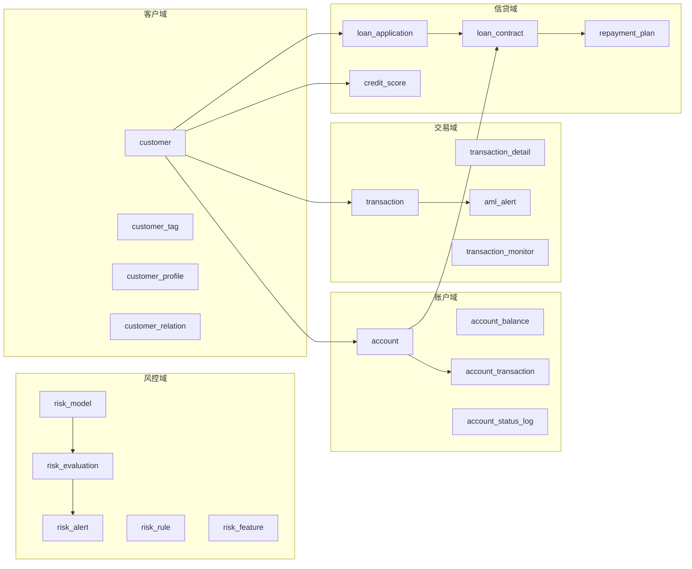

# 金融模板 DDL 表设计说明

> 归属：数据引擎大数据平台 · L5.3 行业应用模板 · 金融模板（finance）
> 任务：T018-2 DDL 表设计（≥20 张，4 人天）
> 上游：T018-1 金融业务模型（`../docs/business-model.md`、`../docs/data-classification.md`）
> 引擎：Apache Doris（主） / Apache Iceberg（备，注释中给出兼容写法）
> 字符集：UTF-8

## 第1章 概述

本目录基于 T018-1 完成的金融业务模型（5 业务域、20 个实体）与数据分级标准（L1~L4），创建金融模板的物理层 DDL 脚本，共 **21 张表**，覆盖风控、客户、账户、交易、信贷 5 个业务域，每域 ≥ 3 张。

DDL 面向 Apache Doris 语法（`DUPLICATE KEY` + `DISTRIBUTED BY HASH` + `PROPERTIES` 动态分区），同时在注释中给出 Apache Iceberg 的兼容写法（`USING iceberg` + `PARTITIONED BY (days(...))`），便于在湖仓一体场景下复用。

### 1.1 设计原则

- **域间低耦合**：5 业务域分文件管理，域间通过外键弱关联（Doris 不强制外键），血缘由 L3.5 资产目录登记。
- **数据分级标注**：每张表在表注释中标注 `数据分级=L1/L2/L3/L4`，按表内最高敏感字段定级，驱动 L3.7 脱敏策略下发与 X2 合规审计。
- **分区策略**：所有表按业务时间字段（`created_at`/`occurred_at`/`due_date` 等）做天级动态分区，便于冷热分离与生命周期管理。
- **审计字段**：每张表统一包含 `created_at` / `updated_at` / `created_by` / `updated_by` 四个审计字段。
- **命名规范**：表名采用金融业务命名（`risk_*` / `customer_*` / `account_*` / `transaction_*` / `loan_*` / `repayment_*` / `credit_*` / `aml_*`），字段名采用 `snake_case`。

### 1.2 文件清单

| 序号 | 文件 | 业务域 | 表数量 | 表清单 |
|---|---|---|---|---|
| 1 | `01_risk_control_ddl.sql` | 风控域 | 5 | risk_model / risk_rule / risk_feature / risk_evaluation / risk_alert |
| 2 | `02_customer_ddl.sql` | 客户域 | 4 | customer / customer_tag / customer_profile / customer_relation |
| 3 | `03_account_ddl.sql` | 账户域 | 4 | account / account_balance / account_transaction / account_status_log |
| 4 | `04_transaction_ddl.sql` | 交易域 | 4 | transaction / transaction_detail / aml_alert / transaction_monitor |
| 5 | `05_credit_ddl.sql` | 信贷域 | 4 | loan_application / loan_contract / repayment_plan / credit_score |
| - | **合计** | **5 域** | **21 张** | - |

## 第2章 表清单与数据分级

### 2.1 风控域（5 张）

| 表名 | 业务含义 | 数据分级 | 分区字段 | 外键关系 |
|---|---|---|---|---|
| risk_model | 风控模型主表（评分卡/ML/规则集元信息与版本） | L2 | created_at | 无（被 risk_rule/risk_feature/risk_evaluation 引用） |
| risk_rule | 风控规则表（规则集/阈值/命中动作） | L2 | updated_at | model_id → risk_model.model_id |
| risk_feature | 风控特征表（特征定义/来源/统计口径） | L2 | updated_at | model_id → risk_model.model_id |
| risk_evaluation | 风控评估结果表（一次评估的输入/命中/决策） | L2 | eval_at | model_id → risk_model.model_id；biz_id → loan_application/transaction |
| risk_alert | 风控告警表（评估产生的告警） | L3 | alert_at | eval_id → risk_evaluation.eval_id；rule_id → risk_rule.rule_id |

### 2.2 客户域（4 张）

| 表名 | 业务含义 | 数据分级 | 分区字段 | 外键关系 |
|---|---|---|---|---|
| customer | 客户基本信息主表（自然人/对公法定属性） | L4 | created_at | 无（被多域引用） |
| customer_tag | 客户标签表（业务/风险标签） | L2 | tagged_at | customer_id → customer.customer_id |
| customer_profile | 客户画像表（计算型画像指标） | L3 | computed_at | customer_id → customer.customer_id |
| customer_relation | 客户关系表（担保/关联/家庭） | L3 | created_at | subject/object_customer_id → customer.customer_id |

### 2.3 账户域（4 张）

| 表名 | 业务含义 | 数据分级 | 分区字段 | 外键关系 |
|---|---|---|---|---|
| account | 账户信息主表（账户生命周期） | L4 | opened_at | customer_id → customer.customer_id |
| account_balance | 账户余额快照表（日终/实时余额） | L3 | snapshot_date | account_id → account.account_id |
| account_transaction | 账户流水表（入账明细） | L4 | posted_at | account_id → account.account_id |
| account_status_log | 账户状态变更日志表 | L2 | changed_at | account_id → account.account_id |

### 2.4 交易域（4 张）

| 表名 | 业务含义 | 数据分级 | 分区字段 | 外键关系 |
|---|---|---|---|---|
| transaction | 交易记录主表（交易全链路发起） | L3 | occurred_at | customer_id → customer；debit/credit_account_id → account |
| transaction_detail | 交易明细表（交易明细行） | L3 | created_at | transaction_id → transaction.transaction_id |
| aml_alert | 反洗钱告警表（AML命中与可疑报告） | L3 | detected_at | transaction_id → transaction；customer_id → customer |
| transaction_monitor | 交易监控表（监控规则命中与告警） | L2 | checked_at | transaction_id → transaction.transaction_id |

### 2.5 信贷域（4 张）

| 表名 | 业务含义 | 数据分级 | 分区字段 | 外键关系 |
|---|---|---|---|---|
| loan_application | 贷款申请表（进件/审批/放款） | L3 | applied_at | customer_id → customer；credit_score_id → credit_score |
| loan_contract | 贷款合同表（合同主表与条款） | L3 | signed_at | application_id → loan_application；repayment_account_id → account |
| repayment_plan | 还款计划表（期次/应还/实还） | L3 | due_date | contract_id → loan_contract.contract_id |
| credit_score | 信用评分表（内部评分与外部征信） | L3 | computed_at | customer_id → customer.customer_id |

## 第3章 执行顺序与依赖关系

DDL 严格按业务域编号顺序执行。由于 Doris 不强制外键，物理上各表可独立创建；但为便于血缘理解与数据装载顺序，建议按以下顺序执行：

```text
01_risk_control_ddl.sql   （风控域：5 张，无外部依赖，可最先执行）
    ↓
02_customer_ddl.sql       （客户域：4 张，无外部依赖，客户主数据，建议优先于账户/交易/信贷）
    ↓
03_account_ddl.sql        （账户域：4 张，依赖客户域 customer.customer_id）
    ↓
04_transaction_ddl.sql    （交易域：4 张，依赖客户域 customer.customer_id 与账户域 account.account_id）
    ↓
05_credit_ddl.sql         （信贷域：4 张，依赖客户域 customer.customer_id 与账户域 account.account_id）
```

### 3.1 依赖关系图



### 3.2 执行命令示例

Doris 命令行执行（按顺序）：

```sql
-- 命令示例：Doris 命令行执行 DDL（按业务域顺序）
mysql -h <doris_fe_host> -P 9030 -u root -p < db_finance < 01_risk_control_ddl.sql
mysql -h <doris_fe_host> -P 9030 -u root -p < db_finance < 02_customer_ddl.sql
mysql -h <doris_fe_host> -P 9030 -u root -p < db_finance < 03_account_ddl.sql
mysql -h <doris_fe_host> -P 9030 -u root -p < db_finance < 04_transaction_ddl.sql
mysql -h <doris_fe_host> -P 9030 -u root -p < db_finance < 05_credit_ddl.sql
```

> 注：执行前需先创建数据库 `CREATE DATABASE IF NOT EXISTS db_finance;` 并 `USE db_finance;`。

## 第4章 DDL 规范说明

### 4.1 表注释规范

每张表的 `COMMENT` 统一格式：

```text
<表中文名> | 数据分级=Lx | <业务含义> | 外键：<外键关系>
```

示例：

```sql
COMMENT '风控规则表 | 数据分级=L2 | 规则集/阈值/命中动作 | 外键：model_id -> risk_model.model_id'
```

### 4.2 字段注释规范

每个字段通过 `COMMENT ON COLUMN <table>.<column> IS '<字段含义>（Lx 敏感说明）'` 说明含义与敏感级别。

### 4.3 分区策略

- **Doris**：采用 `PARTITION BY RANGE (<time_field>) ()` + `dynamic_partition.*` 属性，按天动态分区。
  - `dynamic_partition.start`：历史保留天数（负值），主数据表 -3650（10 年），流水/评估表 -1095（3 年）。
  - `dynamic_partition.end`：预创建未来分区天数，默认 3。
  - `replication_num`：副本数，默认 3。
- **Iceberg**：在注释中给出 `PARTITIONED BY (days(<time_field>))` 兼容写法。

### 4.4 分布键与分桶

- `DISTRIBUTED BY HASH (<主键或高基数字段>) BUCKETS <n>`：
  - 主数据表（customer/account/risk_model 等）：8~16 桶。
  - 流水/评估/告警表（account_transaction/transaction/risk_evaluation 等）：16~32 桶。

### 4.5 审计字段

每张表统一包含：

| 字段 | 类型 | 说明 |
|---|---|---|
| created_at | DATETIME | 创建时间 |
| updated_at | DATETIME | 更新时间 |
| created_by | VARCHAR(64) | 创建人（工号/系统） |
| updated_by | VARCHAR(64) | 更新人（工号/系统） |

### 4.6 数据分级与脱敏

数据分级标注依据 `../docs/data-classification.md`：

| 分级 | 脱敏策略 | 典型字段 |
|---|---|---|
| L1 公开 | 不脱敏 | 币种 currency |
| L2 内部 | 按需脱敏 | 模型参数、规则表达式、风险等级、评分分值 |
| L3 敏感 | 强制脱敏 | 姓名、手机号、地址、余额、交易金额、申请金额、征信报告 |
| L4 高敏感 | 强脱敏/哈希/加密存储 | 身份证号、账户号、对方账户号 |

> 脱敏规则明细见 `../docs/desensitize-rules.yaml`，由 L3.7 安全脱敏按 `sensitiveLevel` 匹配并下推到 L2.7 引擎。

## 第5章 验收对照

| 验收项 | 要求 | 实际 | 结果 |
|---|---|---|---|
| DDL 数量 | ≥ 20 张 | 21 张 | ✅ |
| 覆盖业务域 | 5 域，每域 ≥ 3 张 | 5 域（5/4/4/4/4） | ✅ |
| 表注释 | 每张表含表注释 | 21/21 | ✅ |
| 字段注释 | 每个字段含字段注释 | 全字段覆盖 | ✅ |
| 数据分级标注 | L1~L4 | L2/L3/L4 均有覆盖 | ✅ |
| DDL 语法兼容 | Doris/Iceberg | Doris 主 + Iceberg 注释 | ✅ |
| 分区策略 | 按日期分区 | 全表天级动态分区 | ✅ |
| 主键定义 | PRIMARY KEY | DUPLICATE KEY + HASH 分布键 | ✅ |
| 表命名规范 | 金融业务命名 | risk_*/customer_*/account_*/transaction_*/loan_*/repayment_*/credit_*/aml_* | ✅ |
| README 说明 | 执行顺序与依赖 | 第3章给出 | ✅ |

## 第6章 维护说明

- 新增表时，按业务域归入对应 `0X_<domain>_ddl.sql` 文件，并在本 README 第 2 章表清单与第 1.1 节文件清单中登记。
- 数据分级调整时，同步修改表注释中的 `数据分级=Lx` 标注，并在 `../docs/data-classification.md` 第 2 章映射表中更新。
- 分区保留期调整时，修改对应表 `dynamic_partition.start` 属性，并在本 README 第 4.3 节说明。
- Iceberg 兼容写法以注释形式紧跟在 Doris DDL 之后，迁移到湖仓时取消注释并按 Iceberg 语法调整。