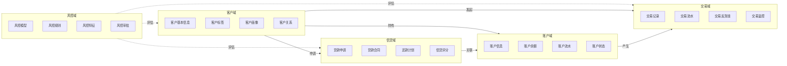
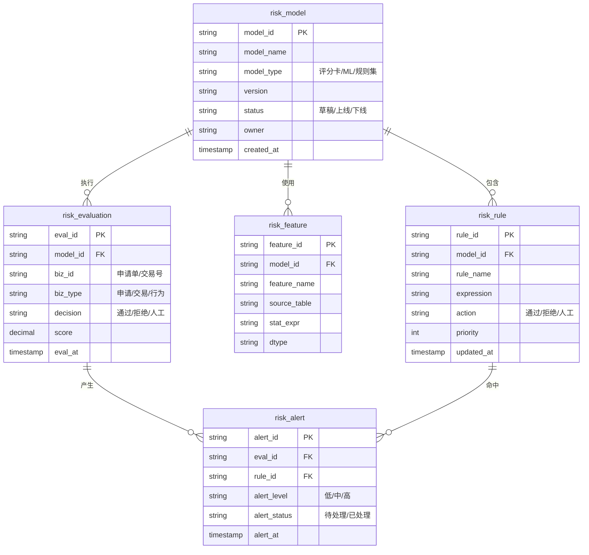
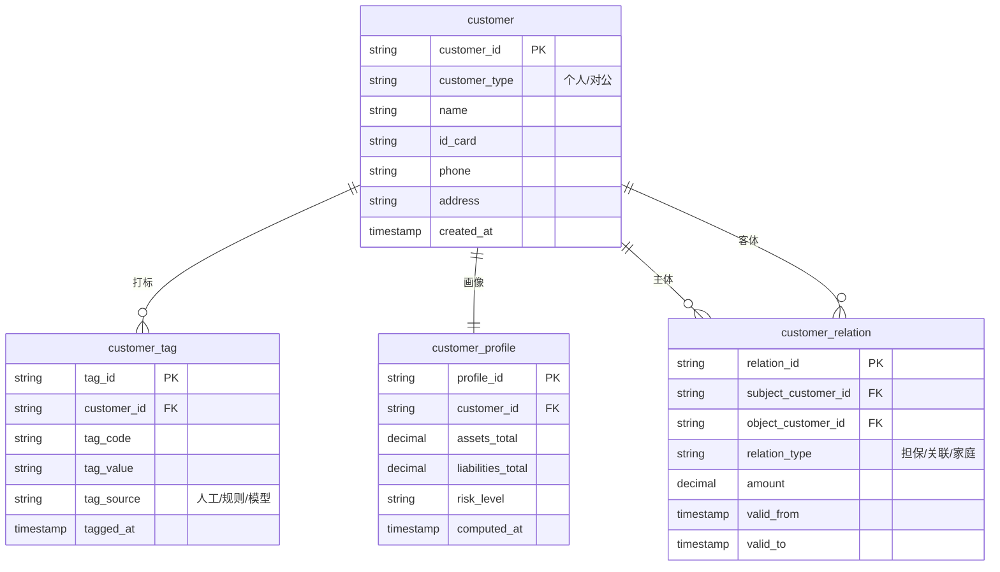
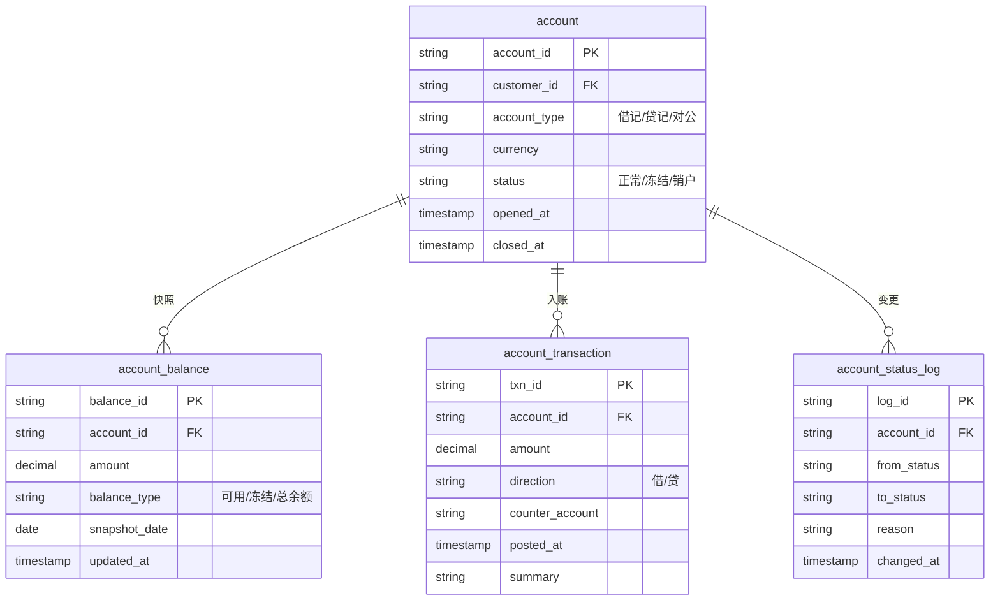
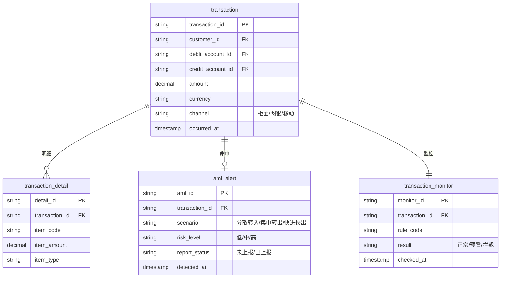
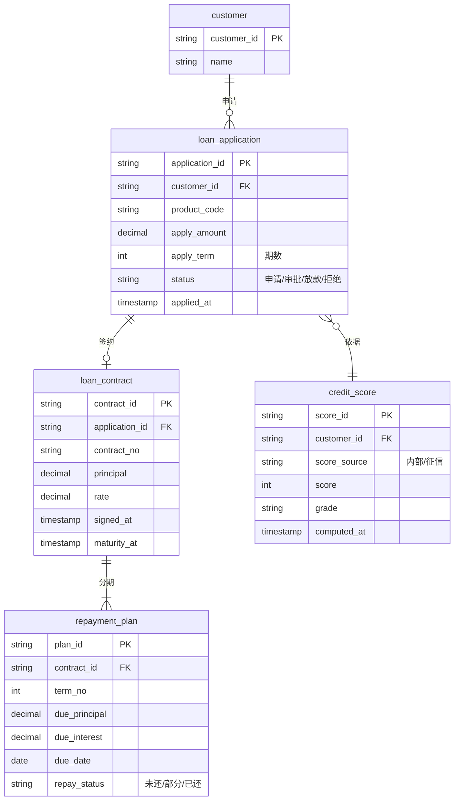
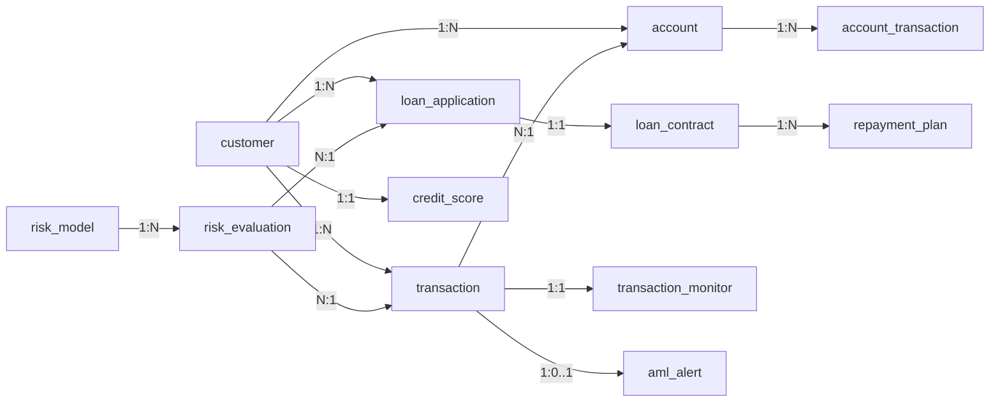

# 金融业务模型设计

> 归属：数擎大数据平台 · L5.3 行业应用模板 · 金融模板（finance）
> 对标：JR/T 0197《金融数据安全 数据安全分级指南》、JR/T 0171《个人金融信息保护技术规范》
> 关联：L3.5 资产目录（业务域/实体注册打标）；L3.7 安全脱敏（按数据分级下发脱敏策略）；L4.4 BI 可视化（按业务域组织仪表盘）
> 用途：作为金融行业模板的业务模型基线，指导 ODS/DWD/DWS 分层建表、资产目录挂载与脱敏策略生成

## 第1章 业务域划分

金融行业模板将业务数据划分为 5 个业务域，域间通过外键/主题关联，域内高内聚、域间低耦合，便于按域授权、按域脱敏、按域治理。

### 1.1 风控域

负责风控模型、规则、特征的管理与审批执行，覆盖申请风控、行为风控、反欺诈、反洗钱识别等场景。

| 子域 | 说明 | 关键实体 |
|---|---|---|
| 风控模型 | 评分卡/ML 模型的元信息与版本 | risk_model |
| 风控规则 | 规则集、阈值、命中动作 | risk_rule |
| 风控特征 | 特征定义、来源、统计口径 | risk_feature |
| 风控审批 | 一次评估的输入、命中、决策 | risk_evaluation、risk_alert |

### 1.2 客户域

承载客户基本信息、标签、画像与客户间关系，是风控、账户、交易、信贷域的主数据来源。

| 子域 | 说明 | 关键实体 |
|---|---|---|
| 客户基本信息 | 自然人/对公客户法定属性 | customer |
| 客户标签 | 业务标签、风险标签 | customer_tag |
| 客户画像 | 计算型画像指标 | customer_profile |
| 客户关系 | 担保、关联、家庭关系 | customer_relation |

### 1.3 账户域

记录账户生命周期、余额、流水与状态变更，是交易与信贷的资金承载。

| 子域 | 说明 | 关键实体 |
|---|---|---|
| 账户信息 | 账户主表 | account |
| 账户余额 | 日终/实时余额快照 | account_balance |
| 账户流水 | 入账明细 | account_transaction |
| 账户状态 | 状态变更日志 | account_status_log |

### 1.4 交易域

记录交易全链路：发起、明细、反洗钱命中与监控告警。

| 子域 | 说明 | 关键实体 |
|---|---|---|
| 交易记录 | 交易主表 | transaction |
| 交易流水 | 交易明细行 | transaction_detail |
| 交易反洗钱 | AML 命中与可疑报告 | aml_alert |
| 交易监控 | 监控规则命中与告警 | transaction_monitor |

### 1.5 信贷域

覆盖贷款申请、合同、还款计划与信贷评分全流程。

| 子域 | 说明 | 关键实体 |
|---|---|---|
| 贷款申请 | 进件、审批、放款 | loan_application |
| 贷款合同 | 合同主表与条款 | loan_contract |
| 还款计划 | 期次、应还、实还 | repayment_plan |
| 信贷评分 | 内部评分与外部征信 | credit_score |

## 第2章 ER图设计

本章为每个业务域给出 ER 图，统一采用 Mermaid `erDiagram` 语法，关系基数标注采用 `||--o{`（1 对 0..N）、`||--|{`（1 对 1..N）、`||--||`（1 对 1）、`}o--o{`（0..N 对 0..N）等符号。

### 2.1 风控域ER图

关系说明：
- `risk_model 1 -- N risk_rule`：一个模型包含多条规则。
- `risk_model 1 -- N risk_feature`：一个模型使用多个特征。
- `risk_evaluation N -- 1 risk_model`：一次评估由一个模型执行。
- `risk_evaluation 1 -- N risk_alert`：一次评估可产生多条告警。
- `risk_rule 1 -- N risk_alert`：一条规则可在多次评估中命中告警。

### 2.2 客户域ER图

关系说明：
- `customer 1 -- N customer_tag`：一个客户可打多个标签。
- `customer 1 -- 1 customer_profile`：一个客户对应一份画像快照。
- `customer 1 -- N customer_relation`：客户作为主体或客体参与多组关系。

### 2.3 账户域ER图

关系说明：
- `account 1 -- N account_balance`：一个账户存在多日/多类型余额快照。
- `account 1 -- N account_transaction`：一个账户产生多条入账明细。
- `account 1 -- N account_status_log`：一个账户的状态变更全程留痕。

### 2.4 交易域ER图

关系说明：
- `transaction 1 -- N transaction_detail`：一笔交易可包含多行明细。
- `transaction 1 -- 0..1 aml_alert`：一笔交易最多命中一条 AML 告警。
- `transaction 1 -- 1 transaction_monitor`：每笔交易均经监控规则校验。

### 2.5 信贷域ER图

关系说明：
- `loan_application 1 -- 0..1 loan_contract`：申请通过后签约一份合同。
- `loan_contract 1 -- 1..N repayment_plan`：一份合同生成至少一期还款计划。
- `loan_application N -- 1 credit_score`：一次申请依据一份评分。
- `customer 1 -- N loan_application`：一个客户可多次申请。

## 第3章 域间关联总览

域间通过外键弱关联，不在物理层做强一致约束，由 L3.5 资产目录登记血缘。

| 关联 | 基数 | 说明 |
|---|---|---|
| customer → account | 1 : N | 一个客户持有多类账户 |
| customer → transaction | 1 : N | 客户作为交易一方 |
| customer → loan_application | 1 : N | 客户多次贷款申请 |
| account → account_transaction | 1 : N | 账户产生入账明细 |
| transaction → account | N : 1 | 交易关联借/贷账户 |
| loan_application → loan_contract | 1 : 1 | 申请通过后签约 |
| loan_contract → repayment_plan | 1 : N | 合同分期还款 |
| risk_evaluation → transaction | N : 1 | 风控评估以交易为输入 |
| risk_evaluation → loan_application | N : 1 | 风控评估以申请为输入 |
| transaction → aml_alert | 1 : 0..1 | 交易至多命中一条 AML 告警 |
| transaction → transaction_monitor | 1 : 1 | 每笔交易均经监控校验 |