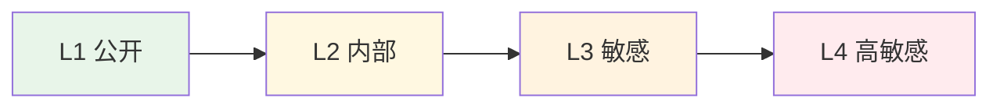
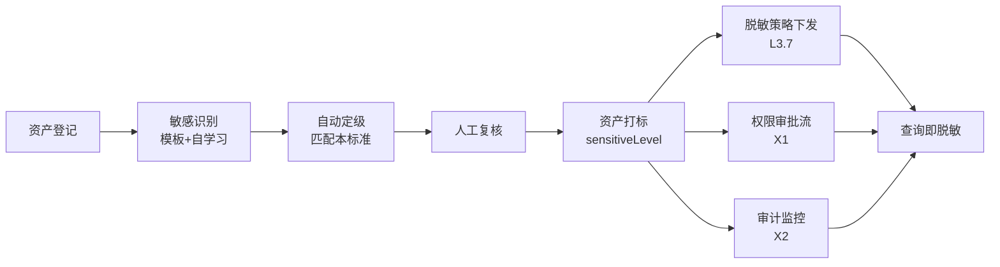

# 金融数据分级标准

> 归属：数擎大数据平台 · L5.3 行业应用模板 · 金融模板（finance）
> 对标：JR/T 0197《金融数据安全 数据安全分级指南》、JR/T 0171《个人金融信息保护技术规范》、《个人信息保护法》
> 关联：L3.5 资产目录（`sensitiveLevel` 字段）；L3.7 安全脱敏（按分级匹配脱敏规则）；X2 安全合规（按分级审计）
> 用途：定义金融模板的数据分级基线，作为资产打标、脱敏策略下发、权限审批与合规审计的依据

## 第1章 数据分级标准

依据 JR/T 0197，按数据泄露后对个人、机构、国家安全与合法权益的影响程度，将金融数据分为 4 级。级别越高，保护要求越严，脱敏与授权约束越强。

### 1.1 L1 公开

- 定义：可对外公开发布、无需任何访问控制的数据。
- 示例：金融产品信息、利率公告、网点信息、对外新闻稿。
- 保护要求：完整性校验，防止被篡改。
- 脱敏要求：无需脱敏。
- 访问要求：无限制。

### 1.2 L2 内部

- 定义：仅限机构内部使用、不对外公开的运营与管理数据。
- 示例：内部报表、运营指标、贷款合同编号、风控模型参数、机构内部代码。
- 保护要求：内部访问控制 + 操作审计。
- 脱敏要求：默认不脱敏，导出时按需打码。
- 访问要求：内部员工经 RBAC 授权可见。

### 1.3 L3 敏感

- 定义：涉及个人隐私或商业敏感，泄露会对个人或机构造成损害的数据。
- 示例：客户姓名、客户手机号、客户地址、账户余额、交易金额、贷款金额、还款记录。
- 保护要求：强访问控制 + 字段级脱敏 + 全量审计。
- 脱敏要求：查询/导出时强制脱敏，授权后可见明文。
- 访问要求：业务岗经审批可见脱敏值，风控/合规岗经审批可见明文。

### 1.4 L4 高敏感

- 定义：核心密钥或极敏感个人隐私，泄露会严重危害个人财产与人身安全或机构核心安全的数据。
- 示例：身份证号、银行卡号、密码、密钥、CVV、生物识别特征、支付密码。
- 保护要求：加密存储 + 最小授权 + 双人审批 + 不可篡改审计。
- 脱敏要求：默认强脱敏（仅留极少位或哈希），明文仅限极少数岗位在强审计下可见。
- 访问要求：默认拒绝，逐次申请审批。

### 1.5 分级总览

| 级别 | 名称 | 影响等级 | 脱敏策略 | 访问模型 | 典型数据 |
|---|---|---|---|---|---|
| L1 | 公开 | 无影响 | 不脱敏 | 无限制 | 产品信息、公告 |
| L2 | 内部 | 内部可控 | 按需脱敏 | 内部 RBAC | 内部报表、合同编号 |
| L3 | 敏感 | 个人/商业损害 | 强制脱敏 | 审批授权 | 手机号、余额、交易金额 |
| L4 | 高敏感 | 严重损害 | 强脱敏/哈希 | 最小授权+双人审批 | 身份证号、密码、密钥 |

## 第2章 分级映射表

下表给出金融模板各业务域主要数据项的分级、定级依据与所属业务域，作为资产目录打标与脱敏规则匹配的基线。完整字段以模板实例化时由 L3.7 敏感识别自动扫描复核。

### 2.1 客户域分级映射

| 数据项 | 分级 | 依据 | 所属业务域 |
|---|---|---|---|
| 客户姓名 | L3 | 个人隐私 | 客户域 |
| 客户手机号 | L3 | 个人隐私 | 客户域 |
| 客户身份证号 | L4 | 核心个人隐私 | 客户域 |
| 客户地址 | L3 | 个人隐私 | 客户域 |
| 客户类型 | L2 | 内部业务标识 | 客户域 |
| 客户标签 | L2 | 内部业务标签 | 客户域 |
| 客户画像资产总额 | L3 | 财务敏感 | 客户域 |
| 客户画像风险等级 | L2 | 内部业务 | 客户域 |
| 客户关系类型 | L2 | 内部业务 | 客户域 |
| 客户关系金额 | L3 | 财务敏感 | 客户域 |

### 2.2 账户域分级映射

| 数据项 | 分级 | 依据 | 所属业务域 |
|---|---|---|---|
| 账户号 | L4 | 资金账户核心标识 | 账户域 |
| 账户类型 | L2 | 内部业务标识 | 账户域 |
| 账户余额 | L3 | 财务敏感 | 账户域 |
| 账户流水金额 | L3 | 财务敏感 | 账户域 |
| 账户状态 | L2 | 内部业务状态 | 账户域 |
| 对方账户号 | L4 | 资金账户核心标识 | 账户域 |
| 账户币种 | L1 | 公开信息 | 账户域 |

### 2.3 交易域分级映射

| 数据项 | 分级 | 依据 | 所属业务域 |
|---|---|---|---|
| 交易号 | L2 | 内部业务标识 | 交易域 |
| 交易金额 | L3 | 财务敏感 | 交易域 |
| 交易渠道 | L2 | 内部业务 | 交易域 |
| 交易时间 | L2 | 内部业务 | 交易域 |
| 交易对手方 | L3 | 个人/商业隐私 | 交易域 |
| AML 命中场景 | L2 | 内部风控 | 交易域 |
| AML 风险等级 | L2 | 内部风控 | 交易域 |
| AML 可疑报告 | L3 | 涉案敏感 | 交易域 |
| 监控拦截结果 | L2 | 内部风控 | 交易域 |

### 2.4 信贷域分级映射

| 数据项 | 分级 | 依据 | 所属业务域 |
|---|---|---|---|
| 贷款申请号 | L2 | 内部标识 | 信贷域 |
| 贷款合同编号 | L2 | 内部标识 | 信贷域 |
| 贷款申请金额 | L3 | 财务敏感 | 信贷域 |
| 贷款合同本金 | L3 | 财务敏感 | 信贷域 |
| 贷款利率 | L2 | 内部业务 | 信贷域 |
| 还款计划应还本金 | L3 | 财务敏感 | 信贷域 |
| 还款计划应还利息 | L3 | 财务敏感 | 信贷域 |
| 还款状态 | L2 | 内部业务状态 | 信贷域 |
| 信贷评分分值 | L2 | 内部业务 | 信贷域 |
| 信贷评分来源 | L2 | 内部业务 | 信贷域 |
| 外部征信报告 | L3 | 个人金融隐私 | 信贷域 |

### 2.5 风控域分级映射

| 数据项 | 分级 | 依据 | 所属业务域 |
|---|---|---|---|
| 风控模型 ID | L2 | 内部业务标识 | 风控域 |
| 风控模型参数 | L2 | 内部业务 | 风控域 |
| 风控模型权重 | L2 | 内部业务 | 风控域 |
| 风控规则表达式 | L2 | 内部业务 | 风控域 |
| 风控特征定义 | L2 | 内部业务 | 风控域 |
| 风控评估决策 | L2 | 内部业务 | 风控域 |
| 风控评估评分 | L2 | 内部业务 | 风控域 |
| 风控告警详情 | L3 | 涉客户/交易敏感 | 风控域 |

### 2.6 平台公共数据分级映射

| 数据项 | 分级 | 依据 | 所属业务域 |
|---|---|---|---|
| 产品信息 | L1 | 公开发布 | 公共 |
| 利率公告 | L1 | 公开发布 | 公共 |
| 网点信息 | L1 | 公开发布 | 公共 |
| 内部运营报表 | L2 | 内部运营 | 公共 |
| 系统密钥 | L4 | 核心安全 | 公共 |
| 数据库连接串密码 | L4 | 核心安全 | 公共 |
| API 鉴权 Token | L4 | 核心安全 | 公共 |

## 第3章 分级治理流程

- 资产登记：模板实例化时由 L3.5 资产目录自动登记所有字段。
- 敏感识别：基于本标准内置模板 + 自学习模型扫描字段名/样例值。
- 自动定级：按本标准第 2 章映射表回写 `sensitiveLevel`。
- 人工复核：数据 Owner 复核自动定级结果，可上调不可下调。
- 资产打标：定级结果写入资产元数据，驱动下游策略。
- 脱敏策略下发：L3.7 按 `sensitiveLevel` 匹配 `desensitize-rules.yaml` 中的规则并下推到 L2.7 引擎。
- 权限审批流：L3/L4 数据访问需经审批流，L4 需双人审批。
- 审计监控：X2 对 L3/L4 访问、导出、脱敏命中全程留痕。

## 第4章 分级与脱敏对应关系

| 分级 | 是否预置脱敏规则 | 默认脱敏强度 | 明文可见岗位 |
|---|---|---|---|
| L1 | 否 | 不脱敏 | 全员 |
| L2 | 按需 | 导出时打码 | 内部授权岗 |
| L3 | 是 | 强制脱敏 | 风控/合规岗（审批后） |
| L4 | 是 | 强脱敏/哈希 | 极少数岗（双人审批+强审计） |

> 脱敏规则明细见同目录 `desensitize-rules.yaml`。